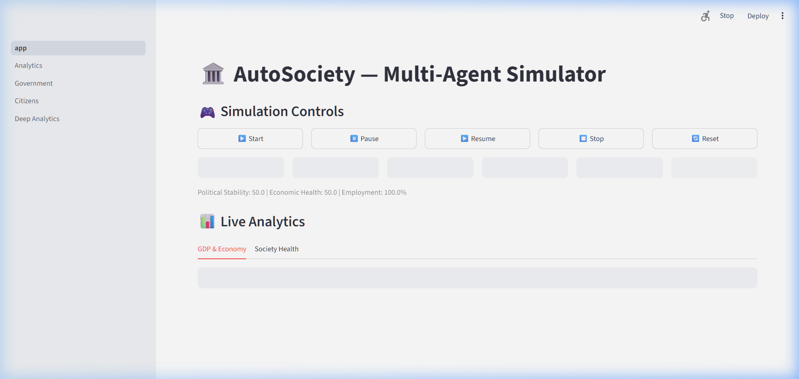
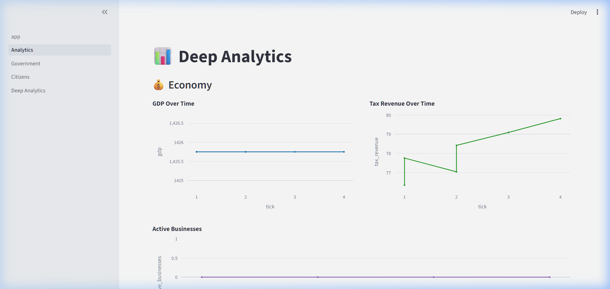
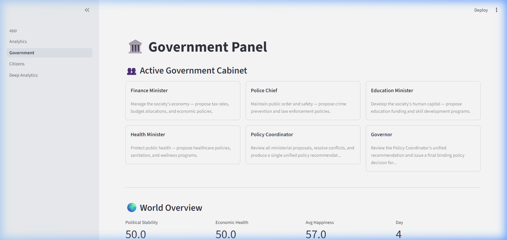
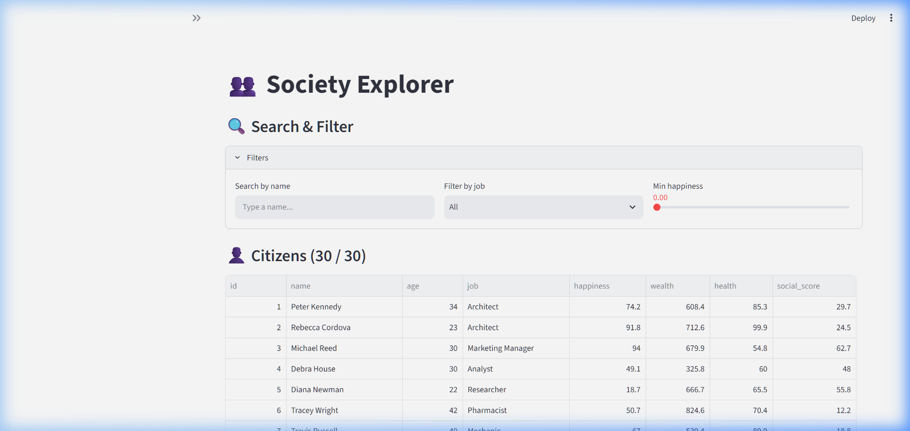

# 🏛️ AutoSociety: Multi-Agent Civilization Simulator

AutoSociety is an interactive multi-agent civilization simulator built on top of **CrewAI**, **FastAPI**, **Streamlit**, and **SQLite**. It simulates a dynamic society where individual citizens go about their daily routines, work, save, and make decisions using a lightweight Local LLM, while a structured coalition of Government Ministers enact monthly macro-economic policies using a high-intelligence Local LLM.

---

## 📸 Visual Tour

### 🖥️ 1. Simulation Control & Live Events Feed
The home dashboard allows starting, pausing, and resetting the simulation. It streams a real-time event log mapping each citizen's decisions and effects.


### 📊 2. Macro Analytics & Wealth Distribution
Displays society-wide averages, GDP trends, and Gini coefficient over time, helping track inequality and standard of living metrics.


### 👑 3. Government Policy Chamber
Every month, the Finance, Police, Education, and Health Ministers analyze the state of the society and propose bills. The Policy Coordinator resolves contradictions, and the Governor issues final approvals.


### 👥 4. Citizen Registry & Agent Memory
Explore the status of all 30 citizens. View their jobs, financial standing, happiness levels, and recent decisions.


### 📈 5. Deep Analytics & Policy Impact Explorer
Our dedicated advanced analytics dashboard displaying correlation matrices, distribution curves, and a structured history of all enacted policies.


---

## ⚡ Architectural Highlights

1. **Hybrid LLM Architecture (Ollama local inference)**:
   - **Citizens (0.5B Model)**: Standard citizen decision loops run sequentially using `qwen2.5-coder:0.5b` to prevent CPU choking, completing decisions in ~15-30s.
   - **Government (3B Model)**: Structural policy work runs on `qwen2.5-coder:3b` (`autosociety-qwen`) for complex multi-step reasoning.
2. **Database Resilience & Automated Backups**:
   - Any destructive action (like database reset or seeding) automatically backs up the database to timestamped `.bak` files.
   - Separate databases for metrics logs (`metrics.db`) and world state (`autosociety.db`).
3. **Environment & Test Suite Isolation**:
   - Automated tests run against separate in-memory / temporary SQLite files (`test_autosociety.db` and `test_metrics.db`), guaranteeing that running tests never corrupts or deletes live simulation progress.
4. **Windows Socket Stability**:
   - Includes custom proactor-loop monkey-patches preventing standard library `ConnectionResetError: [WinError 10054]` crashes on Windows.

---

## 🚀 Quick Start Guide

### 1. Prerequisites
- Python 3.11+
- Ollama installed and running locally

### 2. Pull local Ollama models
```bash
# Pull the citizen fast model
ollama pull qwen2.5-coder:0.5b

# Pull the government high-reasoning model
ollama pull qwen2.5-coder:3b
```

Create a custom model file to pre-bake the context window limit (resolving LiteLLM TypeError issues):
```bash
# Build the autosociety-qwen model
ollama create autosociety-qwen -f Modelfile
```

### 3. Setup Project Environment
Create a virtual environment and install dependencies:
```bash
python -m venv venv
venv\Scripts\activate     # On Windows
source venv/bin/activate  # On Linux/macOS
pip install -r requirements.txt
```

### 4. Database Setup & Seeding
Populate the database with 30 initial randomized citizens (a backup of any existing db will be made automatically):
```bash
python -m autosociety.scripts.seed_dummy_citizens
```

*Tip: If you ever want to add more citizens without wiping history or resetting simulation progress, run:*
```bash
python -m autosociety.scripts.seed_dummy_citizens --append
```

### 5. Launch AutoSociety
Run the unified server startup script to launch the FastAPI backend (port `8243`) and Streamlit web dashboard (port `8501`):
```bash
python -m autosociety.run_sim
```

Open **http://localhost:8501** in your browser, click **▶ Start Simulation** on the left sidebar, and watch the civilization evolve!

---

## 🛠️ Configuration & Development

### Local Settings (`.env`)
Create a `.env` file in the root folder based on `.env.example`:
```ini
OLLAMA_BASE_URL=http://localhost:11434

# Citizen Settings
OLLAMA_CITIZEN_MODEL=qwen2.5-coder:0.5b
OLLAMA_CITIZEN_TIMEOUT=120

# Government Settings
OLLAMA_GOVERNMENT_MODEL=qwen2.5-coder:3b
OLLAMA_GOVERNMENT_TIMEOUT=180
```

### Running Automated Tests
Tests are configured to use fully isolated test databases so you can run them safely at any time:
```bash
python -m pytest
```