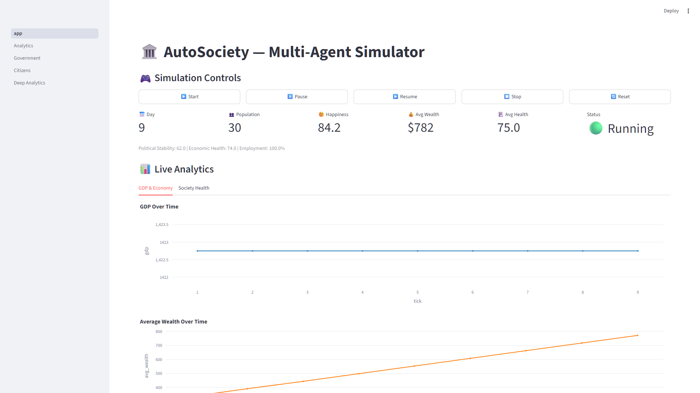
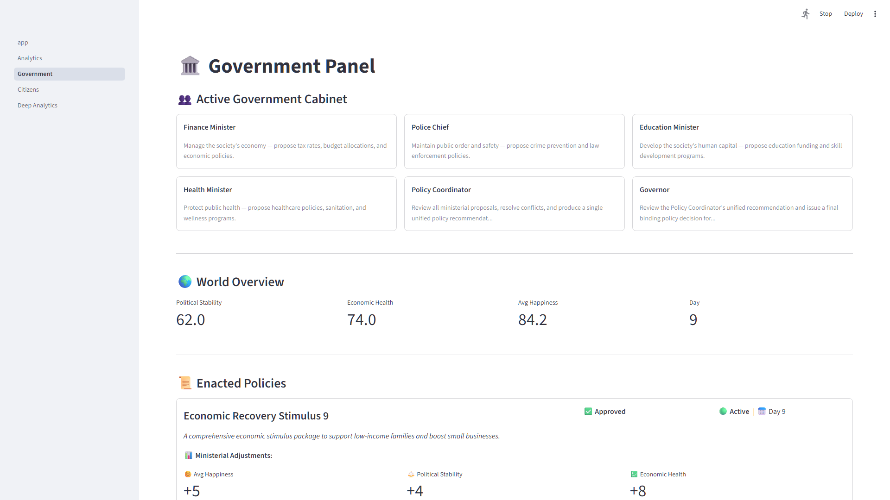
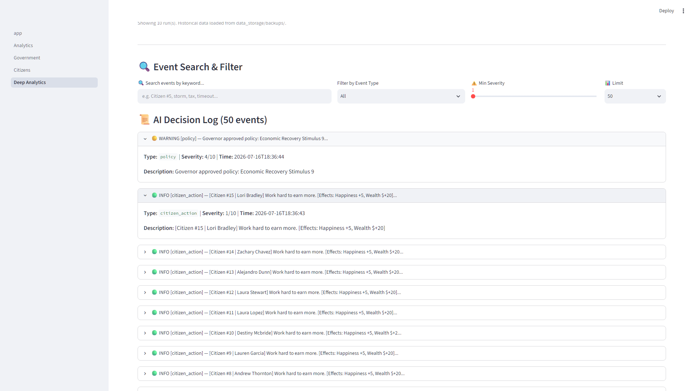
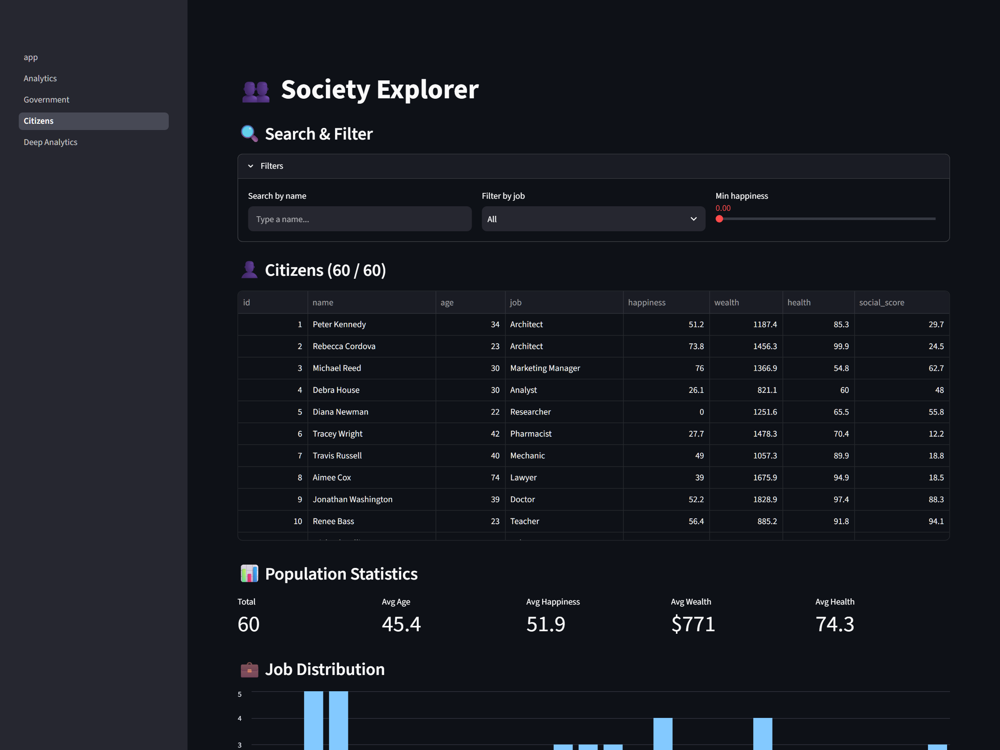
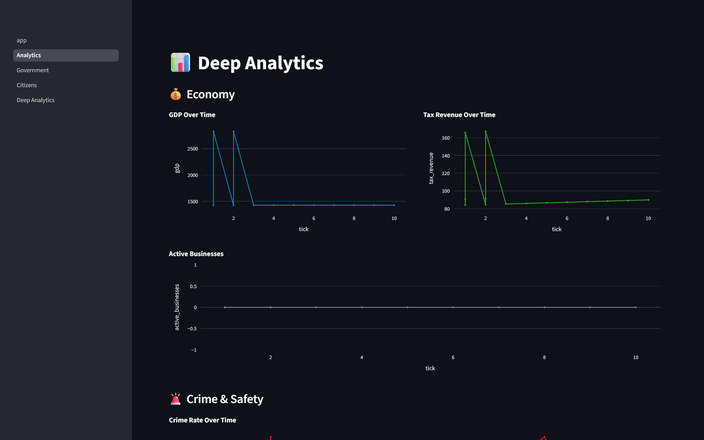

# 🏛️ AutoSociety: Multi-Agent Civilization Simulator

AutoSociety is an interactive multi-agent civilization simulator built on top of **CrewAI**, **FastAPI**, **Streamlit**, and **SQLite**. It simulates a dynamic society where individual citizens go about their daily routines, work, save, and make decisions using a lightweight Local LLM, while a structured coalition of Government Ministers enact monthly macro-economic policies using a high-intelligence Local LLM.

---

## 📸 Visual Tour

All screenshots below live in `assets/screenshots/`. See the [Screenshot Capture Checklist](#-screenshot-capture-checklist) at the bottom for how to regenerate them.

### 🖥️ 1. Simulation Dashboard — Fully Loaded

The main dashboard after several ticks of simulation. The key metrics row shows tick count, population, average happiness, wealth, and health. The live charts below track GDP and average wealth over time as the simulation progresses.


*Figure 1: The main simulation dashboard tracking citizen wealth, happiness, and GDP over a running simulation.*

---

### 👑 2. Government Panel — Cabinet & Enacted Policies

The Government Panel displays the six active cabinet agents (Finance Minister, Police Chief, Education Minister, Health Minister, Policy Coordinator, and Governor) with their designated goals at the top. Below that is the world overview, the table of enacted policies with full descriptions and estimated effects, and a feed of recent government/world events.


*Figure 2: The Government Panel showing the active cabinet, enacted policies table, and recent government events.*

---

### 🔍 3. Deep Analytics & Searchable Event Log

The Deep Analytics page provides the complete chronological event feed with select-box filtering by event type (citizen_action, agent_failure, disaster, government_failure), a minimum severity slider, and keyword search. Each event is shown in an expandable card with the full reasoning text, timestamp, and severity label.


*Figure 3: The Deep Analytics page with event type filter applied, showing expandable AI decision cards with full reasoning text.*

---

### 👥 4. Society Explorer — Citizen Registry

The Society Explorer shows all 30 citizens in a searchable, filterable table with their current stats (happiness, wealth, health, social score). Job distribution and happiness distribution charts appear below.


*Figure 4: The citizen registry with search filters and population statistics.*

---

### 📊 5. Deep Analytics Charts

The Analytics page tracks economy (GDP, tax revenue, active businesses), crime rate, employment rate, and overall society health indicators over time via Plotly charts.


*Figure 5: Economy, crime, and employment trend charts from the Analytics page.*

---

## 📸 Screenshot Capture Checklist

Follow these steps to generate the three new screenshots. Save them to **`autosociety/assets/screenshots/`** in the project root using the filenames below.

### Prerequisites
1. Start the app: `python run_sim.py`
2. Open http://localhost:8501 in your browser

### Shot 1 — `dashboard_fully_loaded.png`
| Step | Action |
|---|---|
| 1 | Click **▶️ Start** on the main dashboard |
| 2 | Wait for at least **6-8 ticks** to pass (watch the "📅 Day" counter increase) |
| 3 | Make sure the GDP and Average Wealth charts have visible lines (not empty) |
| 4 | Hit **Print Screen** / **Snipping Tool** |
| 5 | Save as `assets/screenshots/dashboard_fully_loaded.png` |

### Shot 2 — `government_policies_enacted.png`
| Step | Action |
|---|---|
| 1 | Let the simulation run until at least **tick 6+** (with `TICKS_PER_MONTH=3`, a government policy session fires every 3 ticks — wait for 2 cycles) |
| 2 | Click **Government** in the Streamlit sidebar |
| 3 | Verify the cabinet cards are visible at the top (Finance Minister, Police Chief, etc.) |
| 4 | Verify the **Enacted Policies** table has at least 1-2 rows |
| 5 | Hit **Print Screen** |
| 6 | Save as `assets/screenshots/government_policies_enacted.png` |

### Shot 3 — `deep_analytics_filtered.png`
| Step | Action |
|---|---|
| 1 | Let the simulation run for at least **5+ ticks** so the events log is populated |
| 2 | Click **Deep Analytics** in the Streamlit sidebar |
| 3 | In the "Event type" select-box, choose `citizen_action` to filter |
| 4 | Expand one or two event cards by clicking on them |
| 5 | Hit **Print Screen** |
| 6 | Save as `assets/screenshots/deep_analytics_filtered.png` |

### Folder Setup
If `assets/screenshots/` doesn't exist yet, create it:
```bash
mkdir -p assets/screenshots
```
The README's image tags point to `assets/screenshots/<filename>.png` — no other config needed.

---

## 💻 How to Run Locally (Quick Start Guide)

Follow these step-by-step instructions to set up and run AutoSociety on your local machine with zero setup friction.

### 1. Clone the Repository
Open your terminal and clone the repository to your local machine:
```bash
git clone https://github.com/yourusername/autosociety.git
cd autosociety
```

### 2. Create and Activate a Virtual Environment
We strongly recommend using a virtual environment to isolate project dependencies:
```bash
python -m venv venv

# On Windows (PowerShell or CMD):
venv\Scripts\activate

# On macOS / Linux:
source venv/bin/activate
```

### 3. Install Dependencies
Install all required Python packages from the audited `requirements.txt` file:
```bash
pip install -r requirements.txt
```

### 4. Pull Local Ollama Models & Configure Engine
AutoSociety runs 100% locally using **Ollama**. Ensure Ollama is installed and running, then pull the required models:
```bash
# Pull the fast 0.5B model for sequential citizen daily decisions
ollama pull qwen2.5-coder:0.5b

# Pull the high-reasoning 3B model for government macro-policy work
ollama pull qwen2.5-coder:3b
```

Create the custom pre-baked government model (`autosociety-qwen`) using the provided `Modelfile` (resolving LiteLLM context-window limits):
```bash
ollama create autosociety-qwen -f Modelfile
```

### 5. Seed Database & Run the Simulation
Populate the local SQLite database with initial randomized citizens and launch both the backend server and web dashboard:
```bash
# Seed 30 randomized dummy citizens (automatic safety backups are created if a db already exists)
python -m autosociety.scripts.seed_dummy_citizens

# Run the master simulation script (boots FastAPI on port 8243 and Streamlit on port 8501)
python run_sim.py
```
*(Alternatively, you can run the master launcher using module syntax: `python -m autosociety.run_sim`)*

Once launched, open your browser to **http://localhost:8501**, click **▶️ Start** in the simulation controls, and watch the civilization evolve!

---

## 🛠️ Configuration & Development

### Local Settings (`.env`)
Create a `.env` file in the root folder based on `.env.example`:
```ini
OLLAMA_BASE_URL=http://localhost:11434

# Citizen Settings
OLLAMA_CITIZEN_MODEL=qwen2.5-coder:0.5b
OLLAMA_CITIZEN_TIMEOUT=120

# Government Settings
OLLAMA_GOVERNMENT_MODEL=qwen2.5-coder:3b
OLLAMA_GOVERNMENT_TIMEOUT=180
```

### Running Automated Tests
Tests are configured to use fully isolated test databases so you can run them safely at any time:
```bash
python -m pytest
```