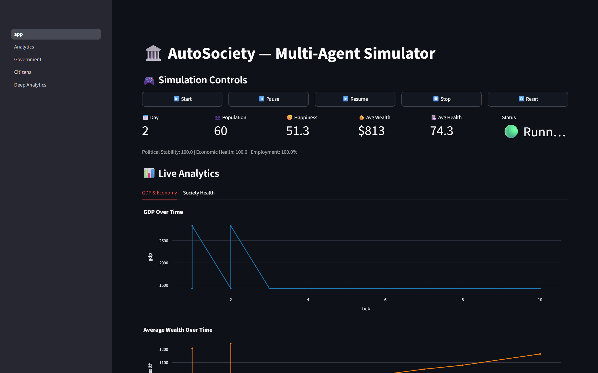
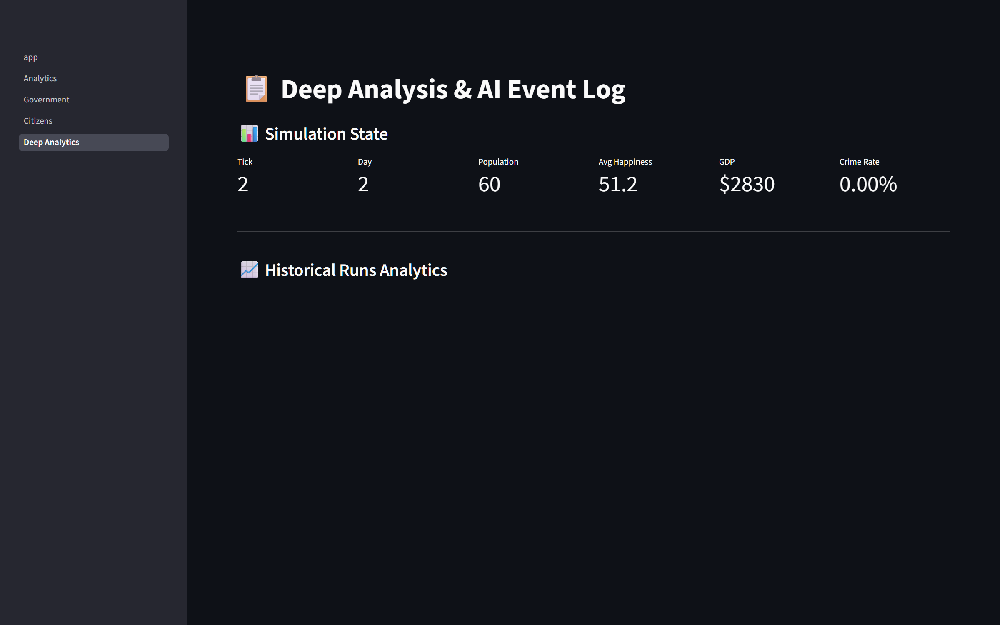
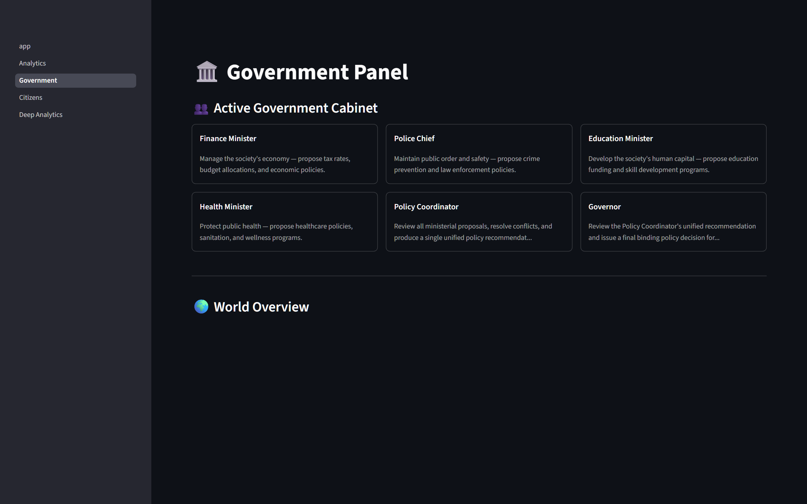
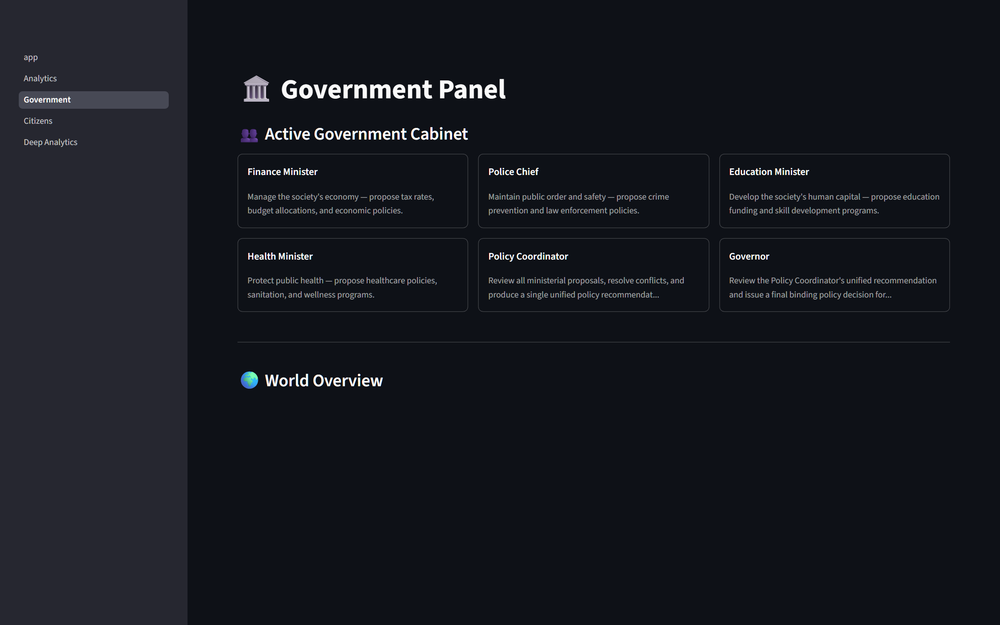
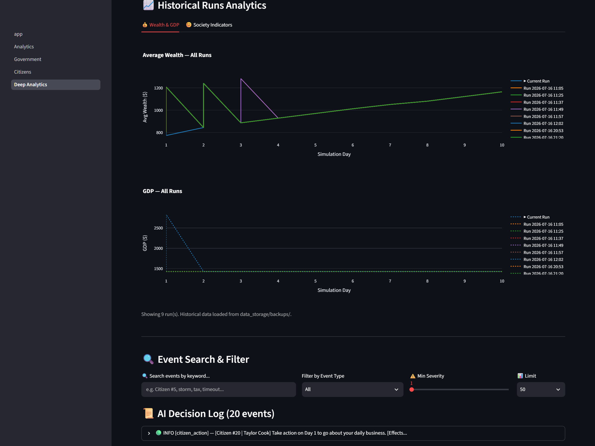
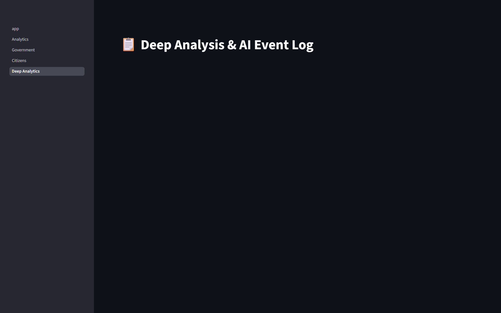

# 🏛️ AutoSociety: Multi-Agent Civilization Simulator

AutoSociety is an interactive multi-agent civilization simulator built on top of **CrewAI**, **FastAPI**, **Streamlit**, and **SQLite**. It simulates a dynamic society where individual citizens go about their daily routines, work, save, and make decisions using a lightweight Local LLM, while a structured coalition of Government Ministers enact monthly macro-economic policies using a high-intelligence Local LLM.

---

## 📸 Visual Tour

<!-- SCREENSHOT_INSTRUCTIONS
To display the screenshots correctly on GitHub, please capture the relevant views from the application and save them into the `docs/screenshots/` directory with the exact filenames specified below.
-->

### 🖥️ 1. Simulation Control & Live Events Feed
The home dashboard allows starting, pausing, and resetting the simulation. It streams a real-time event log mapping each citizen's decisions and effects.
<!-- SCREENSHOT_PLACEHOLDER: Save a screenshot of the main dashboard as docs/screenshots/dashboard_overview.png -->


### 📊 2. Macro Analytics & Wealth Distribution
Displays society-wide averages, GDP trends, and Gini coefficient over time, helping track inequality and standard of living metrics.
<!-- SCREENSHOT_PLACEHOLDER: Save a screenshot of macro analytics charts as docs/screenshots/macro_analytics.png -->


### 🧠 3. Hybrid LLM Model Performance Stats
View the execution time, token metrics, and performance analytics comparing citizen models and government models to track CPU usage and decision latency.
<!-- SCREENSHOT_PLACEHOLDER: Save a screenshot of the model execution speed and stats as docs/screenshots/hybrid_model_stats.png -->


### 👑 4. Government Policy Chamber & Enacted Policies
Every month, the Finance, Police, Education, and Health Ministers analyze the state of the society and propose bills. The Policy Coordinator resolves contradictions, and the Governor issues final approvals.
<!-- SCREENSHOT_PLACEHOLDER: Save a screenshot of the government panel view as docs/screenshots/government_panel.png -->


The **Enacted Policies** sub-panel tracks the history of all passed bills, their economic parameters (such as tax rates, public spending), and their direct impact on key metrics over time.
<!-- SCREENSHOT_PLACEHOLDER: Save a screenshot of the enacted policies table as docs/screenshots/enacted_policies.png -->


### 👥 5. Citizen Registry & Agent Memory
Explore the status of all 30 citizens. View their jobs, financial standing, happiness levels, and recent decisions.
<!-- SCREENSHOT_PLACEHOLDER: Save a screenshot of the citizens registry view as docs/screenshots/citizen_registry.png -->


### 🔍 6. Deep Analytics & Events Search Log
Our dedicated advanced analytics dashboard displaying correlation matrices, distribution curves, and a structured history of all events. Features select-box filtering by event types (Crimes, Disasters, Policies, Agent Failures, Economic) and keyword search over the logs table.
<!-- SCREENSHOT_PLACEHOLDER: Save a screenshot of the deep analytics and logs search page as docs/screenshots/deep_analytics.png -->


### 💾 7. Historical Database Backups & Restoration
Manage automated and manual database run backups, select previous run snapshots, and restore them to overlay comparative metrics on the historical analytics view.
<!-- SCREENSHOT_PLACEHOLDER: Save a screenshot of the backup restoration controls/dashboard as docs/screenshots/backup_restoration.png -->


---

## ⚡ Architectural Highlights

1. **Hybrid LLM Architecture (Ollama local inference)**:
   - **Citizens (0.5B Model)**: Standard citizen decision loops run sequentially using `qwen2.5-coder:0.5b` to prevent CPU choking, completing decisions in ~15-30s.
   - **Government (3B Model)**: Structural policy work runs on `qwen2.5-coder:3b` (`autosociety-qwen`) for complex multi-step reasoning.
   
   <!-- SCREENSHOT_PLACEHOLDER: Save your hybrid model stats/performance screenshot as docs/screenshots/hybrid_model_stats.png -->
   

2. **Symmetrical Day-to-Tick Engine**:
   - 1 Simulation Tick maps symmetrically and translates mathematically to 1 Day in the world timeline. The backend engine serves as the single authority on simulation day.

3. **Resilient Database Backups & Restoration**:
   - Every simulation initialization or manual reset triggers an automatic, concurrent backup of the active database (`autosociety.db`) and historical metrics database (`metrics.db`) as WAL-safe timestamped companion files in `data_storage/backups/`.
   - Past run snapshots are dynamically merged and restored on the Historical Analytics dashboard for comparative multi-run chart overlays.
   
   <!-- SCREENSHOT_PLACEHOLDER: Save your database backup/restoration UI screenshot as docs/screenshots/backup_restoration.png -->
   

4. **Advanced Event Analytics**:
   - Deep Analytics page features select-box filtering by event types (Crimes, Disasters, Policies, Agent Failures, Economic) and keyword search over the logs table, processed via server-side SQLite query filters.
   
   <!-- SCREENSHOT_PLACEHOLDER: Save your search and filter events screenshot as docs/screenshots/deep_analytics.png -->
   

5. **Environment & Test Suite Isolation**:
   - Automated tests run against separate in-memory / temporary SQLite files (`test_autosociety.db` and `test_metrics.db`), guaranteeing that running tests never corrupts or deletes live simulation progress.

6. **Windows Socket Stability**:
   - Includes custom proactor-loop monkey-patches preventing standard library `ConnectionResetError: [WinError 10054]` crashes on Windows.

---

## 💻 How to Run Locally (Quick Start Guide)

Follow these step-by-step instructions to set up and run AutoSociety on your local machine with zero setup friction.

### 1. Clone the Repository
Open your terminal and clone the repository to your local machine:
```bash
git clone https://github.com/yourusername/autosociety.git
cd autosociety
```

### 2. Create and Activate a Virtual Environment
We strongly recommend using a virtual environment to isolate project dependencies:
```bash
python -m venv venv

# On Windows (PowerShell or CMD):
venv\Scripts\activate

# On macOS / Linux:
source venv/bin/activate
```

### 3. Install Dependencies
Install all required Python packages from the audited `requirements.txt` file:
```bash
pip install -r requirements.txt
```

### 4. Pull Local Ollama Models & Configure Engine
AutoSociety runs 100% locally using **Ollama**. Ensure Ollama is installed and running, then pull the required models:
```bash
# Pull the fast 0.5B model for sequential citizen daily decisions
ollama pull qwen2.5-coder:0.5b

# Pull the high-reasoning 3B model for government macro-policy work
ollama pull qwen2.5-coder:3b
```

Create the custom pre-baked government model (`autosociety-qwen`) using the provided `Modelfile` (resolving LiteLLM context-window limits):
```bash
ollama create autosociety-qwen -f Modelfile
```

### 5. Seed Database & Run the Simulation
Populate the local SQLite database with initial randomized citizens and launch both the backend server and web dashboard:
```bash
# Seed 30 randomized dummy citizens (automatic safety backups are created if a db already exists)
python -m autosociety.scripts.seed_dummy_citizens

# Run the master simulation script (boots FastAPI on port 8243 and Streamlit on port 8501)
python run_sim.py
```
*(Alternatively, you can run the master launcher using module syntax: `python -m autosociety.run_sim`)*

Once launched, open your browser to **http://localhost:8501**, click **▶️ Start** in the simulation controls, and watch the civilization evolve!

---

## 🛠️ Configuration & Development

### Local Settings (`.env`)
Create a `.env` file in the root folder based on `.env.example`:
```ini
OLLAMA_BASE_URL=http://localhost:11434

# Citizen Settings
OLLAMA_CITIZEN_MODEL=qwen2.5-coder:0.5b
OLLAMA_CITIZEN_TIMEOUT=120

# Government Settings
OLLAMA_GOVERNMENT_MODEL=qwen2.5-coder:3b
OLLAMA_GOVERNMENT_TIMEOUT=180
```

### Running Automated Tests
Tests are configured to use fully isolated test databases so you can run them safely at any time:
```bash
python -m pytest
```